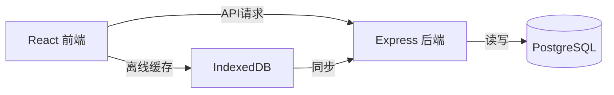

# 💰 实用记账App开发文档

## 项目概述

开发一个功能完善、体验优秀的个人财务管理应用，帮助用户轻松记录日常收支、分析消费习惯、制定理财目标。

---

## 核心功能模块

### 🏠 首页仪表盘
| 功能 | 描述 |
|------|------|
| 月度概览 | 本月收入、支出、结余金额展示 |
| 快速记账 | 一键添加收支记录 |
| 近期流水 | 最近5-10条交易记录 |
| 预算进度 | 月度预算使用情况可视化 |

### 📝 记账功能
| 功能 | 描述 |
|------|------|
| 收入记录 | 支持工资、奖金、投资收益等多种类型 |
| 支出记录 | 餐饮、交通、购物、娱乐等分类 |
| 转账记录 | 账户间转账 |
| 智能识别 | 根据金额自动推荐分类 |
| 标签系统 | 自定义标签便于筛选 |
| 备注&图片 | 添加备注和发票/小票照片 |

### 📊 统计分析
| 功能 | 描述 |
|------|------|
| 收支趋势 | 周/月/年度趋势图表 |
| 分类占比 | 饼图展示各类支出占比 |
| 对比分析 | 环比/同比数据对比 |
| 支出排行 | 消费金额TOP10 |
| 导出报告 | 生成Excel/PDF财务报告 |

### 💳 账户管理
| 功能 | 描述 |
|------|------|
| 多账户 | 现金、银行卡、信用卡、支付宝、微信等 |
| 资产总览 | 全部资产一目了然 |
| 账户余额 | 实时余额同步 |
| 负债管理 | 信用卡还款提醒 |

### 🎯 预算管理
| 功能 | 描述 |
|------|------|
| 总预算 | 设定月度/年度总预算 |
| 分类预算 | 为各消费类别设独立预算 |
| 超支预警 | 接近或超过预算时提醒 |
| 预算建议 | 基于历史数据的智能建议 |

### ⏰ 提醒功能
| 功能 | 描述 |
|------|------|
| 记账提醒 | 每日定时提醒记账 |
| 账单提醒 | 信用卡还款、房租等周期性提醒 |
| 周报/月报 | 自动生成财务摘要推送 |

---

## 技术架构

### 前端技术栈 (React)
```
├── 框架: React 18
├── 构建工具: Vite
├── UI组件: 自定义组件库
├── 图表: ECharts
├── 路由: React Router v6
├── 状态: Zustand
├── 请求: Axios + React Query
└── 样式: CSS Modules + CSS Variables
```

### 后端技术栈 (云同步)
```
├── 运行时: Node.js
├── 框架: Express
├── 数据库: SQLite (开发) / PostgreSQL (生产)
├── ORM: Prisma
├── 认证: JWT + Refresh Token
└── API: RESTful
```

### 云同步架构


### 同步策略
| 场景 | 策略 |
|------|------|
| 在线 | 实时同步到云端 |
| 离线 | 本地IndexedDB缓存 |
| 恢复 | 自动合并冲突数据 |

### 本地存储方案
```javascript
// IndexedDB 实现离线优先 + 云同步
const dbSchema = {
  transactions: '++id, date, type, amount, category, account, syncStatus',
  accounts: '++id, name, type, balance, icon, syncStatus',
  categories: '++id, name, type, icon, color',
  budgets: '++id, category, amount, period',
  syncQueue: '++id, action, data, timestamp'  // 离线操作队列
}
```

---

## 数据模型设计

### 交易记录 (Transaction)
```typescript
interface Transaction {
  id: string;
  type: 'income' | 'expense' | 'transfer';
  amount: number;
  category: string;
  accountId: string;
  targetAccountId?: string;  // 转账目标账户
  date: Date;
  note?: string;
  tags?: string[];
  attachments?: string[];
  createdAt: Date;
  updatedAt: Date;
}
```

### 账户 (Account)
```typescript
interface Account {
  id: string;
  name: string;
  type: 'cash' | 'bank' | 'credit' | 'alipay' | 'wechat' | 'investment';
  balance: number;
  icon: string;
  color: string;
  isDefault: boolean;
  order: number;
}
```

### 分类 (Category)
```typescript
interface Category {
  id: string;
  name: string;
  type: 'income' | 'expense';
  icon: string;
  color: string;
  parentId?: string;  // 支持子分类
  budget?: number;
  order: number;
}
```

### 预算 (Budget)
```typescript
interface Budget {
  id: string;
  categoryId?: string;  // null 表示总预算
  amount: number;
  period: 'weekly' | 'monthly' | 'yearly';
  startDate: Date;
  alertThreshold: number;  // 预警阈值 (0-1)
}
```

---

## UI/UX 设计规范

### 设计原则
1. **简洁高效** - 最常用的操作3次点击内完成
2. **信息清晰** - 关键数据一目了然
3. **视觉愉悦** - 现代化设计语言
4. **操作流畅** - 丝滑的动画过渡

### 配色方案
```css
:root {
  /* 主色调 - 清新绿 */
  --primary: #10B981;
  --primary-light: #34D399;
  --primary-dark: #059669;
  
  /* 语义色 */
  --income: #10B981;    /* 收入 - 绿色 */
  --expense: #EF4444;   /* 支出 - 红色 */
  --transfer: #6366F1;  /* 转账 - 紫色 */
  
  /* 中性色 */
  --bg-primary: #FFFFFF;
  --bg-secondary: #F9FAFB;
  --text-primary: #111827;
  --text-secondary: #6B7280;
  
  /* 暗色模式 */
  --dark-bg: #1F2937;
  --dark-surface: #374151;
  --dark-text: #F9FAFB;
}
```

### 字体规范
```css
:root {
  --font-family: 'Inter', 'PingFang SC', 'Microsoft YaHei', sans-serif;
  --font-size-xs: 0.75rem;   /* 12px */
  --font-size-sm: 0.875rem;  /* 14px */
  --font-size-base: 1rem;    /* 16px */
  --font-size-lg: 1.125rem;  /* 18px */
  --font-size-xl: 1.25rem;   /* 20px */
  --font-size-2xl: 1.5rem;   /* 24px */
  --font-size-3xl: 2rem;     /* 32px */
}
```

### 页面布局

```
┌─────────────────────────────────────┐
│           Header (可选)             │
├─────────────────────────────────────┤
│                                     │
│                                     │
│         主内容区域                   │
│         (可滚动)                    │
│                                     │
│                                     │
├─────────────────────────────────────┤
│  ⬤    📝    ➕    📊    👤         │
│ 首页  账单  记账  统计  我的        │
└─────────────────────────────────────┘
```

---

## 项目结构

```
accountbook/
├── client/                    # React 前端
│   ├── index.html
│   ├── src/
│   │   ├── main.jsx
│   │   ├── App.jsx
│   │   ├── components/        # 通用组件
│   │   ├── pages/             # 页面组件
│   │   │   ├── Home/
│   │   │   ├── Transactions/
│   │   │   ├── AddTransaction/
│   │   │   ├── Statistics/
│   │   │   ├── Accounts/
│   │   │   ├── Auth/          # 登录/注册
│   │   │   └── Settings/
│   │   ├── stores/            # Zustand 状态
│   │   ├── services/
│   │   │   ├── api.js         # API 请求
│   │   │   ├── db.js          # IndexedDB
│   │   │   └── sync.js        # 同步逻辑
│   │   ├── hooks/             # 自定义 Hooks
│   │   ├── utils/
│   │   └── styles/
│   └── package.json
│
├── server/                    # Express 后端
│   ├── src/
│   │   ├── index.js           # 入口
│   │   ├── routes/            # API 路由
│   │   │   ├── auth.js
│   │   │   ├── transactions.js
│   │   │   ├── accounts.js
│   │   │   └── sync.js
│   │   ├── controllers/       # 控制器
│   │   ├── models/            # Prisma 模型
│   │   ├── middleware/        # 中间件
│   │   │   ├── auth.js
│   │   │   └── validate.js
│   │   └── utils/
│   ├── prisma/
│   │   └── schema.prisma      # 数据库模型
│   └── package.json
│
└── package.json               # 工作区配置
```

---

## 开发路线图

### 第一阶段：基础架构 (1周)
- [ ] 项目初始化 (Vite + React)
- [ ] 后端搭建 (Express + Prisma)
- [ ] 用户认证 (注册/登录/JWT)
- [ ] 数据库模型设计

### 第二阶段：核心功能 (2周)
- [ ] 添加收支记录
- [ ] 交易流水列表
- [ ] 首页仪表盘
- [ ] 账户管理模块
- [ ] 分类管理模块

### 第三阶段：数据分析 (1周)
- [ ] 统计图表 (ECharts)
- [ ] 搜索与筛选
- [ ] 数据导出

### 第四阶段：云同步 (1周)
- [ ] IndexedDB 离线缓存
- [ ] 同步队列机制
- [ ] 冲突检测与合并
- [ ] 离线/在线状态处理

### 第五阶段：增强体验 (1周)
- [ ] 预算管理
- [ ] 提醒功能
- [ ] 暗色模式
- [ ] PWA 支持

---

## 验证计划

### 功能测试
1. **记账功能测试**
   - 添加收入/支出/转账记录
   - 验证金额计算正确性
   - 测试分类和标签功能

2. **统计功能测试**
   - 验证图表数据准确性
   - 测试不同时间范围筛选

3. **数据持久化测试**
   - 刷新页面后数据保留
   - 测试数据导入导出

### 用户手动测试
1. 在浏览器中打开应用
2. 完整体验记账流程
3. 检查UI交互是否流畅
4. 验证功能是否符合预期
